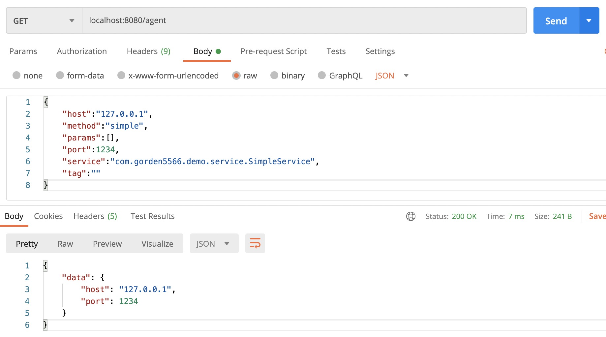

# Rpc Agent

Rpc Agent is a framework, with which you can develop an agent server for a RPC framework.

## Quick Start

Rpc Agent provide a simple demo for a quick start. 

### How to Build

1. Make sure maven has been installed on your machine

2. Run `mvn clean package` to build this project

    at the last, if success, you will see message like this

```
[INFO] Reactor Summary for rpc-agent-parent 1.0-SNAPSHOT:
[INFO]
[INFO] rpc-agent-parent ................................... SUCCESS [  0.190 s]
[INFO] rpc-agent-core ..................................... SUCCESS [  2.016 s]
[INFO] rpc-agent-server ................................... SUCCESS [  2.363 s]
[INFO] rpc-agent-console .................................. SUCCESS [  0.421 s]
[INFO] rpc-agent-demo ..................................... SUCCESS [  0.002 s]
[INFO] rpc-agent-simple ................................... SUCCESS [  0.686 s]
[INFO] ------------------------------------------------------------------------
[INFO] BUILD SUCCESS
[INFO] ------------------------------------------------------------------------
```

rpc-agent-simple is a demo, and the target jar file is `rpc-agent-simple-1.0-SNAPSHOT-jar-with-dependencies.jar`, you can rename it to `rpc-agent-simple.jar`.

### How to use

Run `java -jar rpc-agent-simple.jar -h` to see what you can do with this tool

```
Usage: java -jar rpc-agent-simple.jar [options]
  Options:
    -h, --help
      print help message
      Default: false
    -d, --demo
      export config demo
      Default: false
    -f, --file
      [client mode] specified config file
      Default: request.json
    -s, --server
      [server mode] enable server mode
      Default: false
    -l, --local
      [server mode] use loopback address
      Default: false
    -p, --port
      [server mode] specified server port
      Default: 8080
    -v, --version
      print version info
      Default: false
```

Run `java -jar rpc-agent-simple.jar -d` to export demo config file

```
write config file: demo.json
```

Open `demo.json` to see the config format 

```
{
	"host":"127.0.0.1",
	"method":"simple",
	"params":[],
	"port":1234,
	"service":"com.gorden5566.demo.service.SimpleService",
	"tag":""
}
```

### Run in Client Mode

Run command `java -jar rpc-agent-simple.jar -f demo.json` to start a remote call 

```
java -jar rpc-agent-simple.jar -f demo.json
reqid: 010256f87c064f06be6070e293053865
{
        "data":{
                "host":"127.0.0.1",
                "port":1234
        }
}
```

### Run in Server Mode

Run command `java -jar rpc-agent-simple.jar -s` to start agent server, and you can use `-l` option to use loopback address, use `-p` option to set server port.

If server started success, it will log to console like this

```
server started, agent path: [localhost:8080/agent]
```

then you can start a remote call with Postman or other tools



## How to develop

See rpc-agent-simple module 

```
├── java
│   └── com
│       └── gorden5566
│           └── rpc
│               └── agent
│                   └── simple
│                       ├── SimpleInvoker.java
│                       ├── SimpleInvokerBuilder.java
│                       └── SimpleRpcConfigParser.java
└── resources
    └── META-INF
        └── services
            ├── com.gorden5566.rpc.agent.core.spi.InvokerBuilder
            └── com.gorden5566.rpc.agent.core.spi.RpcConfigParser
```

1. `RpcConfigParser`: parse request config to `RpcRequest` and `InvokerConfig`

2. `RpcRequest`: the parameter for a remote call

3. `InvokerConfig`: the remote server

4. `InvokerBuilder`: to bulid a concrete `Invoker`, for example, a `Invoker` for dubbo

As you see, what you need to do is provide a `RpcConfigParser` and a `Invoker` with `InvokerBuilder`, then you can register all this with SPI file `com.gorden5566.rpc.agent.core.spi.InvokerBuilder` and `com.gorden5566.rpc.agent.core.spi.RpcConfigParser`.

At last, you can custom title or vendor in `pom.xml`

```
<build>
    <plugins>
        <plugin>
            <groupId>org.apache.maven.plugins</groupId>
            <artifactId>maven-assembly-plugin</artifactId>
            <version>3.2.0</version>
            <executions>
                <execution>
                    <phase>package</phase>
                    <goals>
                        <goal>single</goal>
                    </goals>
                </execution>
            </executions>
            <configuration>
                <descriptorRefs>
                    <descriptorRef>jar-with-dependencies</descriptorRef>
                </descriptorRefs>
                <archive>
                    <manifestEntries>
                        <main-Class>com.gorden5566.rpc.agent.server.BootStrap</main-Class>
                        <Implementation-Version>${project.version}</Implementation-Version>
                        <Implementation-Title>rpc-agent-simple</Implementation-Title>
                        <Implementation-Vendor>gorden5566</Implementation-Vendor>
                    </manifestEntries>
                </archive>
            </configuration>
        </plugin>
    </plugins>
</build>
```
